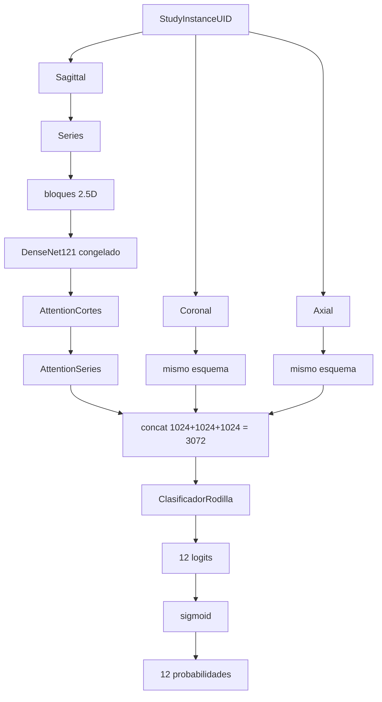

# RSNA Knee MRI — clasificación multietiqueta con DenseNet121 y atención jerárquica

Pipeline de clasificación **multietiqueta** de 12 hallazgos en resonancia magnética de rodilla (DICOM). Cada estudio se representa en los planos Sagittal, Coronal y Axial mediante bloques 2.5D, un extractor **DenseNet121** preentrenado en ImageNet (congelado) y dos módulos de atención (`AttentionCortes`, `AttentionSeries`) que se concatenan en un vector de 3072 dimensiones y se proyectan a 12 logits.

.

---

## Índice

1. [Título y alcance](#1-título-y-alcance)
2. [Objetivo del proyecto](#2-objetivo-del-proyecto)
3. [Dataset](#3-dataset)
4. [Las 12 etiquetas](#4-las-12-etiquetas)
5. [Organización de los DICOM](#5-organización-de-los-dicom)
6. [Preprocesamiento](#6-preprocesamiento)
7. [Transfer learning](#7-transfer-learning)
8. [Arquitectura completa](#8-arquitectura-completa)
9. [`AttentionCortes`](#9-attentioncortes)
10. [`AttentionSeries`](#10-attentionseries)
11. [Fusión de planos](#11-fusión-de-planos)
12. [Clasificador final](#12-clasificador-final)
13. [Función de pérdida](#13-función-de-pérdida)
14. [Optimización](#14-optimización)
15. [División train / validation](#15-división-train--validation)
16. [Feature cache](#16-feature-cache)
17. [Entrenamiento reanudable](#17-entrenamiento-reanudable)
18. [Resultados del entrenamiento](#18-resultados-del-entrenamiento)
19. [Métricas](#19-métricas)
20. [Thresholds por patología](#20-thresholds-por-patología)
21. [Inferencia sobre test](#21-inferencia-sobre-test)
22. [Tablas de salida](#22-tablas-de-salida)
23. [Kaggle submission](#23-kaggle-submission)
24. [Grad-CAM](#24-grad-cam)
25. [Explicación celda por celda](#25-explicación-celda-por-celda-del-notebook)
26. [Flujo completo](#26-flujo-completo-del-proyecto)
27. [Estructura del repositorio](#27-estructura-del-repositorio)
28. [Dependencias](#28-dependencias)
29. [Entorno](#29-entorno)
30. [Cómo ejecutar el proyecto](#30-cómo-ejecutar-el-proyecto)
31. [Archivos que no deberían subirse a GitHub](#31-archivos-grandes-y-gitignore)
32. [Limitaciones actuales](#32-limitaciones-actuales)
33. [Mejoras futuras](#33-mejoras-futuras)
34. [Conclusión](#34-conclusión)

---

## 1. Título y alcance

**RSNA Knee MRI – Multi-label Classification with DenseNet121 and Hierarchical Attention**

El notebook principal es `produccion/Knee.ipynb` (kernel `.venv (knee)`). Hay dos entrenamientos sobre el mismo caché de DenseNet:

| Versión | Checkpoint | Criterio de selección | Uso actual en test (P4) |
|---|---|---|---|
| **v1** (5 épocas) | `modelos_knee/best_model.pt` | menor *validation loss* (época 4) | respaldo si no existe v2 |
| **v2** (15 épocas) | `modelos_knee/best_model_v2.pt` | mayor *macro AUC* (época 8) | **preferido**: P4 carga `best_model_v2.pt` si existe |

El paquete `produccion/src/rsna_knee/` copia el preprocesamiento del notebook (`preprocess.py` = celda 10; `dicom.py` ≈ celda 8). El `KneePipeline` de `model.py` es más simple (atención `Linear→1`, dropout 0.3) y **no** es el código con el que se guardaron `best_model.pt` / `best_model_v2.pt`. El entrenamiento documentado está en el notebook.

---

## 2. Objetivo del proyecto

**Problema.** Dado un estudio de MRI de rodilla (varias series DICOM en tres planos), estimar de forma simultánea la presencia o ausencia de 12 hallazgos.

**Entrada.** Identificador `StudyInstanceUID`, series asociadas (`train_series.csv` / `test_series.csv`) y archivos `.dcm` bajo `dataset_extraido/train_series/` o `test_series/`.

**Salida.** 12 logits → `sigmoid` → 12 probabilidades en \([0,1]\). Con umbrales por etiqueta se obtiene un vector binario 0/1 (formato `submission.csv`).

**Por qué multietiqueta.** Un mismo estudio puede tener varios hallazgos a la vez (por ejemplo derrame y menisco). No se usa softmax entre las 12 clases: cada logit es una decisión independiente (`BCEWithLogitsLoss` en v1; `AsymmetricLoss` en v2).

---

## 3. Dataset

Las rutas se leen de `.env` (`config/env.example`):

```text
BASE_PATH=/Volumes/ADATA HD680/KAGGLE_RSNA
TRAIN_CSV=train_cursor.csv
```

El notebook define:

```text
TRAIN   = BASE / train_cursor.csv          # etiquetas
series  = BASE / train_series.csv
DATASET = BASE / dataset_extraido
TRAIN_IMAGES = DATASET / train_series
TEST_IMAGES  = DATASET / test_series
test.csv, test_series.csv  (bajo DATASET, celda P4)
```

| Recurso | Rol |
|---|---|
| `train_cursor.csv` | Una fila por estudio: `StudyInstanceUID`, opcional `Report`, y las 12 etiquetas |
| `train_series.csv` | Una fila por serie: `StudyInstanceUID`, `SeriesInstanceUID`, `Anatomical_Plane`, `Fluid_Sensitive`, `Fat_Suppression` |
| `train.csv` | CSV de la competencia (el paquete `rsna_knee` lo usa como fallback de etiquetas en Kaggle) |
| `test.csv` | Lista de `StudyInstanceUID` de test |
| `test_series.csv` | Series de test (mismos campos de plano / FS) |
| DICOM | `*.dcm` por serie |

`LABELS` se obtiene como todas las columnas de `train_df` excepto `StudyInstanceUID` y `Report`. El notebook exige `len(LABELS) == 12`.

**Tamaños verificados en este repo** (el disco ADATA no estaba montado al documentar, así que no se recontó el CSV):

- `modelos_knee/y_true_validacion.npy` y `y_prob_validacion.npy` tienen forma **`(882, 12)`**.
- El split es `n_train = int(n * 0.80)` por `StudyInstanceUID` (celda 20). Eso es **compatible** con 4407 estudios → 3525 train / 882 val.
- `feature_cache_densenet121/` contiene **24 386** archivos `.pt` (conteo en disco).
- `submission.csv` contiene **3** estudios de test.

`Fluid_Sensitive` y `Fat_Suppression` se **conservan** en el dict de la serie; no se filtran. La atención de series decide el peso.

---

## 4. Las 12 etiquetas

Nombres tomados de las columnas del CSV (no se añaden criterios diagnósticos extra).

| # | Label | Descripción (nombre) |
|---|---|---|
| 1 | ACL | Ligamento cruzado anterior |
| 2 | MCL | Ligamento colateral medial |
| 3 | Medial Meniscus | Menisco medial |
| 4 | Lateral Meniscus | Menisco lateral |
| 5 | Medial OA | Osteoartritis medial |
| 6 | Lateral OA | Osteoartritis lateral |
| 7 | PF OA | Osteoartritis patelofemoral |
| 8 | Effusion | Derrame |
| 9 | Synovitis | Sinovitis |
| 10 | Baker's | Quiste de Baker |
| 11 | Contusion | Contusión |
| 12 | Fracture | Fractura |

---

## 5. Organización de los DICOM

Estructura esperada:

```text
dataset_extraido/train_series/
    {StudyInstanceUID}/
        {SeriesInstanceUID}/
            *.dcm
```

Test usa el mismo esquema bajo `test_series/`.

**Orden de cortes.** Los nombres de archivo no se usan como orden. `posicion_corte(ds)`:

1. Intenta `ImageOrientationPatient` × `ImagePositionPatient`: la normal del plano (producto cruzado de los dos vectores de orientación) y el producto punto con la posición.
2. Si falla: `SliceLocation`.
3. Si falla: `InstanceNumber` (o 0).

`cargar_serie` lee solo cabeceras (`stop_before_pixels=True`), ordena por esa posición y guarda `path` + `position`. `PhotometricInterpretation == MONOCHROME1` invierte la imagen en `leer_corte`.

No hay `RescaleSlope` / `RescaleIntercept` en el notebook ni en `src/rsna_knee/dicom.py`.

---

## 6. Preprocesamiento

La **celda 10** define las mismas cuatro funciones que `src/rsna_knee/preprocess.py` (`serie_a_volumen`, `normalizar_volumen`, `crear_25d`, `redimensionar_bloque`). El notebook no importa el paquete: es código duplicado. La única diferencia menor es que el `.py` arma `mean`/`std` ImageNet en cada llamada a `redimensionar_bloque`, y el notebook usa los tensores globales `IMAGENET_MEAN` / `IMAGENET_STD` de la celda 2. El resultado es el mismo.

| Función | Qué hace |
|---|---|
| `serie_a_volumen` | Lee todos los cortes; si hay tamaños distintos, interpola a (H, W) del primero; apila en `[Z, H, W]` |
| `normalizar_volumen` | Percentiles **1 y 99**, clip, escala a \([0,1]\) |
| `crear_25d` | Si hay menos de 3 cortes, vacío. Si no, bloques `[vol[i-1], vol[i], vol[i+1]]` para `i = 1 … Z-2` |
| `redimensionar_bloque` | Bilinear a **224×224** y normalización ImageNet (`mean` 0.485/0.456/0.406, `std` 0.229/0.224/0.225) |

**2.5D.** Tres cortes consecutivos se tratan como los 3 canales de una imagen RGB, para reutilizar DenseNet121 de ImageNet sin cambiar el stem. El canal central es el corte de interés; los vecinos aportan contexto espacial a lo largo de la pila.

---

## 7. Transfer learning

DenseNet121 con `DenseNet121_Weights.IMAGENET1K_V1`. Se usa `densenet.features` como `extractor`.

- Parámetros **congelados** (`requires_grad = False`) y `extractor.eval()`.
- No se entrena DenseNet desde cero.
- **No hay RadImageNet** (ni ningún otro checkpoint médico) en el código.
- Cada bloque 2.5D produce un vector de **1024** dimensiones (`F.adaptive_avg_pool2d` + `flatten`).

```text
MRI 2.5D  [3, 224, 224]
        ↓
DenseNet121.features  (ImageNet, congelado)
        ↓
GAP
        ↓
1024 features
```

El caché guarda exactamente esos vectores por serie, para no volver a pasar el backbone.

---

## 8. Arquitectura completa



```text
Study
├── Sagittal
│   ├── Series (todas las de ese plano)
│   │   ├── bloques 2.5D
│   │   ├── DenseNet121 → [N, 1024]
│   │   └── AttentionCortes → [1024]
│   └── AttentionSeries → [1024]
├── Coronal  → [1024]
└── Axial    → [1024]

concat 3072 → ClasificadorRodilla → 12 logits → sigmoid
```

---

## 9. `AttentionCortes`

**Versión v1** (celda 16; la de las 5 épocas y `best_model.pt`):

- Entrada `x` de forma `[N, 1024]` (N = número de bloques 2.5D de la serie).
- `nn.Sequential(Linear(1024, 256), Tanh(), Linear(256, 1))`.
- `softmax` en `dim=0` (sobre los N bloques).
- Salida: suma ponderada `[1024]` y el vector de pesos.

Sirve para condensar una serie de longitud variable en un solo descriptor, dando más peso a los cortes que la red considera más informativos.

**Versión v2** (celda 36; `best_model_v2.pt`): `LayerNorm`, hidden 512, `GELU`, dropout 0.1, proyección `Linear(1024,1024)+GELU`, y dropout aleatorio de cortes en train (`dropout_slices=0.15` si `N > 4`).

Si una serie no tiene bloques (`N = 0`), `procesar_serie` devuelve un cero de 1024.

---

## 10. `AttentionSeries`

Mismo mecanismo que `AttentionCortes`, aplicado a las **series de un plano** (varias filas de `train_series.csv` con el mismo `Anatomical_Plane`).

No se eliminan variantes `Fluid_Sensitive` / `Fat_Suppression`. Si el plano no tiene series, el vector del plano es cero.

v1: hidden 256 + Tanh. v2: LayerNorm + hidden 512 + GELU + proyección.

Salida por plano: **1024**.

---

## 11. Fusión de planos

```text
Sagittal 1024  +  Coronal 1024  +  Axial 1024  →  3072
```

`forward_estudio` / `forward_estudio_cache`:

```python
torch.cat([sag, cor, axi], dim=-1)
```

No hay pooling extra ni producto bilinear; solo concatenación.

---

## 12. Clasificador final

**v1 — `ClasificadorRodilla` (celda 16), usada en `best_model.pt`:**

```text
Linear(3072, 512)
ReLU
Dropout(0.4)
Linear(512, 12)
```

Los 12 números son **logits** (pre-sigmoid), uno por etiqueta.

**v2 — misma clase, redefinida (celda 36), usada en `best_model_v2.pt`:**

```text
LayerNorm(3072)
Linear(3072, 1024) → GELU → Dropout(0.35)
Linear(1024, 256)  → GELU → Dropout(0.25)
Linear(256, 12)
```

El paquete `src/rsna_knee/model.py` usa `CabezaMultiplanar` con Dropout **0.3**; no coincide con los checkpoints del notebook.

---

## 13. Función de pérdida

**v1:** `nn.BCEWithLogitsLoss(pos_weight=pos_weight)`.

Multietiqueta: cada patología es un Bernoulli independiente. `pos_weight = (n - pos) / pos` por columna en el split de train (los positivos se recortan a mínimo 1). Penaliza más el error en clases raras.

**v2:** clase `AsymmetricLoss` (`gamma_neg=4`, `gamma_pos=0`, `clip=0.05`). Diseñada para bajar el peso de negativos fáciles. La escala numérica de esta loss no es comparable con la BCE de v1.

---

## 14. Optimización

| | v1 | v2 |
|---|---|---|
| Optimizador | AdamW | AdamW |
| Learning rate | `1e-4` | `3e-4` |
| Weight decay | `1e-4` | `1e-4` |
| Scheduler | ninguno | `CosineAnnealingLR` (`T_max=15`, `eta_min=1e-6`) |
| Gradient clipping | `max_norm=1.0` | `max_norm=1.0` |
| Acumulación | 1 estudio / step | 8 estudios (`ACCUM_V2`) |
| Semilla | `SEED = 42` | `SEED_V2 = SEED` |

**Se entrenan** `attention_cortes`, `attention_series` y `clasificador`.

**No se entrenan** los pesos de DenseNet (`extractor` bajo `torch.no_grad()` al extraer features).

v2 además duplica en cada época los estudios con Fracture / Contusion / MCL / Synovitis (`rare_w > 1.5`).

---

## 15. División train / validation

Celda 20:

- Copia de `StudyInstanceUID`, shuffle con `np.random.default_rng(SEED)` (`SEED = 42`).
- `n_train = int(len(study_ids) * 0.80)`.
- Filtro de `train_df` por esos IDs.

Se divide **por estudio**, no por serie ni por corte, para que la misma rodilla no aparezca en train y val (fuga de información).

Validación materializada: **882** estudios × 12 etiquetas (`y_true_validacion.npy`).

---

## 16. Feature cache

DenseNet está congelada, así que las features de una serie son deterministas. Recalcularlas cada época implicaría releer todos los DICOM.

**Antes:** DICOM → preprocess → DenseNet → features, en cada época.  
**Después:** `{SeriesInstanceUID}.pt` en `produccion/feature_cache_densenet121/` → Attention → clasificador.

- Un archivo por `SeriesInstanceUID`.
- Tensor 2D `[N_bloques, 1024]`, `float32` (ejemplo inspeccionado: `(46, 1024)`).
- Escritura atómica: `.tmp` + `replace`.
- `crear_cache_completo()` salta `.pt` ya existentes (reanudable).
- En disco hay **24 386** `.pt`.

`procesar_serie_cache` reintenta hasta 10 veces ante `EOFError`, `OSError` o `TimeoutError` (lecturas inestables, p. ej. disco externo), con `time.sleep`.

El ADATA se trata como NTFS de solo lectura; el caché y los checkpoints se escriben en el Mac (`CACHE_DIR`, `MODEL_DIR`).

---

## 17. Entrenamiento reanudable

v1 guarda `modelos_knee/entrenamiento_5epocas_resume.pt` cada 100 estudios (train o val) con:

`epoch`, `phase` (`train`/`val`), `next_position`, `loss_acumulado`, `train_loss_current`, `state_dict` de atención y clasificador, `optimizer`, `historial`, `best_val_loss`.

También se escribe `epoch_{k}.pt` al terminar cada época y `best_model.pt` si mejora la val loss.

v2 usa `entrenamiento_v2_resume.pt` (incluye `scheduler` y `best_auc`) y `epoch_v2_{k}.pt`.

Si el proceso se corta, la siguiente ejecución continúa en la época, fase y posición guardadas, sin repetir las horas ya hechas.

Existen además restos de un primer intento: `epoch1_resume.pt`, `epoch1_parcial_1800.pt`, `orden_epoch1.npy`.

---

## 18. Resultados del entrenamiento

### v1 — 5 épocas (`best_model.pt`, menor val loss)

Valores leídos de `epoch_5.pt` / `best_model.pt` (`historial`).

| Epoch | Train Loss | Validation Loss |
|---|---:|---:|
| 1 | 1.4270 | 1.3705 |
| 2 | 1.2608 | 1.2819 |
| 3 | 1.1941 | 1.1949 |
| **4** | **1.1349** | **1.1475** |
| 5 | 1.1140 | 1.2254 |

De la 1 a la 4 bajan train y val. En la 5 el train sigue bajando y la val **sube**: señal de sobreajuste. El mejor modelo es la **época 4**.

### v2 — 15 épocas (`best_model_v2.pt`, mayor macro AUC)

Loss ASL (no comparable con la tabla v1). Extraído de `epoch_v2_15.pt`.

| Epoch | Train Loss | Val Loss | Val AUC | F1@0.5 |
|---|---:|---:|---:|---:|
| 1 | 0.1555 | 0.1362 | 0.6977 | 0.3522 |
| 2 | 0.1483 | 0.1328 | 0.7207 | 0.3869 |
| 3 | 0.1443 | 0.1314 | 0.7274 | 0.3824 |
| 4 | 0.1411 | 0.1294 | 0.7447 | 0.3815 |
| 5 | 0.1378 | 0.1285 | 0.7391 | 0.3946 |
| 6 | 0.1348 | 0.1278 | 0.7449 | 0.3972 |
| 7 | 0.1315 | 0.1306 | 0.7290 | 0.3693 |
| **8** | **0.1273** | **0.1277** | **0.7540** | **0.4058** |
| 9 | 0.1232 | 0.1292 | 0.7475 | 0.4120 |
| 10 | 0.1174 | 0.1306 | 0.7454 | 0.4026 |
| 11 | 0.1127 | 0.1324 | 0.7413 | 0.4068 |
| 12 | 0.1081 | 0.1365 | 0.7533 | 0.4166 |
| 13 | 0.1034 | 0.1369 | 0.7478 | 0.4169 |
| 14 | 0.1014 | 0.1357 | 0.7475 | 0.4188 |
| 15 | 0.0998 | 0.1376 | 0.7469 | 0.4184 |

El checkpoint `best_model_v2.pt` corresponde a la **época 8**. Después el train loss sigue bajando y el AUC de val no vuelve a superar 0.754.

---

## 19. Métricas

Calculadas en **validación** (882 estudios). No hay etiquetas de test en el repo.

### v1, umbral 0.5 — `metricas_validacion_epoca4.csv`

Promedios de las 12 filas (coinciden con los globales pedidos en el brief):

| Métrica | Valor |
|---|---:|
| ROC-AUC macro | 0.7367 |
| F1 macro | 0.3910 |
| F1 micro | 0.4749 |
| Precision macro | 0.3150 |
| Sensibilidad (recall) macro | 0.5453 |
| Especificidad media | 0.7179 |

| Patología | ROC-AUC | F1 | Precisión | Recall | Espec. |
|---|---:|---:|---:|---:|---:|
| ACL | 0.765 | 0.382 | 0.286 | 0.575 | 0.759 |
| MCL | 0.697 | 0.225 | 0.154 | 0.420 | 0.767 |
| Medial Meniscus | 0.710 | 0.507 | 0.434 | 0.608 | 0.626 |
| Lateral Meniscus | 0.752 | 0.356 | 0.263 | 0.553 | 0.727 |
| Medial OA | 0.763 | 0.453 | 0.331 | 0.717 | 0.628 |
| Lateral OA | 0.797 | 0.460 | 0.338 | 0.720 | 0.668 |
| PF OA | 0.752 | 0.556 | 0.432 | 0.782 | 0.555 |
| Effusion | 0.751 | 0.712 | 0.634 | 0.811 | 0.512 |
| Synovitis | 0.834 | 0.412 | 0.338 | 0.527 | 0.878 |
| Baker's | 0.655 | 0.438 | 0.389 | 0.500 | 0.733 |
| Contusion | 0.681 | 0.120 | 0.077 | 0.278 | 0.783 |
| Fracture | 0.684 | 0.071 | 0.105 | 0.054 | 0.980 |

Con umbrales que maximizan F1 en val (`metricas_umbral_optimo.csv`): F1 macro **0.4228** (el AUC no cambia).

### v2, umbrales F1 — `metricas_umbral_optimo_v2.csv`

ROC-AUC macro **0.7543**, F1 macro **0.4434**.

**Cómo leer las métricas**

- **ROC-AUC:** calidad del ranking de scores, independiente del umbral.
- **F1:** media armónica de precisión y recall sobre la predicción 0/1.
- **Macro:** media no ponderada de las 12 clases (las raras pesan igual).
- **Micro:** agrega TP/FP/FN de todas las clases (dominan las frecuentes, p. ej. Effusion).
- **Precision / Recall / Especificidad:** clásicas por etiqueta.

No hay evaluación con etiquetas de test; el test del repo es inferencia (3 estudios).

---

## 20. Thresholds por patología

El modelo produce una probabilidad `p`. Decisión:

```text
p >= umbral  →  1
p <  umbral  →  0
```

`mejor_umbral_f1` recorre `np.linspace(0.05, 0.95, 19)` y guarda el corte de mayor F1 **en validación**. Se serializa en `umbrales_f1.npy`.

v1 (ejemplos): Synovitis 0.70; MCL / menisco medial 0.20; Fracture / Contusion 0.25.  
v2 (el que usa el test actual, `umbrales_utilizados.csv`): la mayoría 0.50–0.60.

Ajustar umbrales en val **no** es una evaluación en un test etiquetado independiente: el F1 “óptimo” está sesgado hacia ese split.

---

## 21. Inferencia sobre test

Celda P4 (49):

1. `test.csv` → lista de `StudyInstanceUID` (3 en `submission.csv`).
2. `cargar_estudio_test` lee DICOM de `test_series/` (no usa el caché de train).
3. `forward_estudio` (DenseNet en vivo + atención + clasificador).
4. `sigmoid` y comparación con `umbrales_f1.npy`.
5. Carga **`best_model_v2.pt`** si existe; si no, `best_model.pt`.
6. Escribe `modelos_knee/submission.csv`.

Hay que tener en memoria las clases de la versión del checkpoint (v2 si se carga `best_model_v2.pt`).

---

## 22. Tablas de salida

Archivos **presentes** en `produccion/modelos_knee/`:

| Archivo | Contenido verificado |
|---|---|
| `submission.csv` | 3 estudios, 12 columnas 0/1 + `StudyInstanceUID` |
| `test_decisiones_0_1.csv` | Mismas 3 filas 0/1 que el submission |
| `test_probabilidades_porcentaje.csv` | Probabilidad × 100 por patología |
| `test_umbrales.csv` | Umbral en % (p. ej. ACL 55.0) |
| `umbrales_utilizados.csv` | Umbral decimal y % |
| `test_resultado_detallado.csv` | Por etiqueta: `Decision`, `Prob_%`, `Umbral_%`, `Sobre_Umbral` (`SI`/`NO`) |

La celda P4 **actual** solo escribe `submission.csv` (y muestra un `DataFrame` con columnas `*_prob`). Los CSV detallados existen en disco como artefactos de una exportación posterior o de una versión anterior del notebook; no aparecen como `to_csv` en `Knee.ipynb` vigente.

Ejemplo (primer estudio de `test_resultado_detallado.csv`):

```text
ACL: Decision=0, Prob=44.84%, Umbral=55%, Sobre_Umbral=NO
Medial Meniscus: Decision=1, Prob=59.83%, Umbral=55%, Sobre_Umbral=SI
```

Otros CSV de métricas: `metricas_validacion_epoca4.csv`, `metricas_umbral_optimo.csv`, `metricas_umbral_optimo_v2.csv`.

---

## 23. Kaggle submission

`submission.csv`:

```text
StudyInstanceUID, ACL, MCL, Medial Meniscus, Lateral Meniscus,
Medial OA, Lateral OA, PF OA, Effusion, Synovitis, Baker's, Contusion, Fracture
```

Valores 0/1 (enteros), una fila por estudio de `test.csv`. Es el formato que espera la celda P4 para la competencia/proyecto.

---

## 24. Grad-CAM

**Qué es.** Mapa de calor de la contribución espacial de la última capa de DenseNet (`extractor.norm5`) a un logit de clase.

**Implementación (P5, celda 52).** No usa `pytorch_grad_cam` en el forward actual (la celda 51 aún hace `%pip install grad-cam scikit-image`). El mapa se calcula a mano en **CPU** (`CamWrapper`):

- Un corte 2.5D → DenseNet → ReLU → GAP → el clasificador recibe **el mismo vector de 1024 repetido tres veces** (no recorre las tres series reales).
- Clase objetivo: `argmax` de las 12 probs del **estudio completo** (`forward_estudio`).
- Se toma el bloque central de la **primera serie** de cada plano.
- Overlay con mapa `jet` de matplotlib; PNG en `gradcam_test/`.

Eso **no** es una explicación end-to-end del pipeline (omita `AttentionCortes` / `AttentionSeries` reales). Es una aproximación espacial sobre DenseNet.

Hay **18** PNG en `gradcam_test/`. Además, `explicabilidad_25d/` guarda mapas de un estudio de test para `PF_OA` (cortes concretos + `puntos3D.csv`); no es la celda P5.

**Tres niveles de interpretabilidad en la arquitectura:**

| Nivel | Qué indica |
|---|---|
| `AttentionCortes` | Qué bloques 2.5D de una serie pesan más |
| `AttentionSeries` | Qué serie de un plano pesa más |
| Grad-CAM (wrapper) | Qué región 2D del corte influyó en el logit, bajo la simplificación anterior |

No es validación clínica.

---

## 25. Explicación celda por celda del notebook

Notebook: `produccion/Knee.ipynb` (53 celdas). Las pruebas (P1–P5) están **al final** a propósito.

### Celda 0 — Portada

**Qué hace.** Describe el pipeline y el índice del notebook.  
**Tipo.** Documentación.

### Celda 1–2 — Imports, rutas, semilla

**Qué hace.** Carga librerías, `.env`, `BASE_PATH`, `CACHE_DIR`, `MODEL_DIR`, constantes (`IMAGE_SIZE=224`, `FEATURE_DIM=1024`, `PLANOS`), `SEED=42`, dispositivo MPS o CPU.  
**Por qué.** Todo el pipeline depende de rutas y de una semilla única.  
**Salidas.** `BASE`, `TRAIN_IMAGES`, `device`, `SEED`.  
**Papel.** Arranque. Falla si el ADATA no está montado.

### Celda 3–4 — Cargar CSV

**Qué hace.** `train_df = read_csv(TRAIN)`, `series_df = read_csv(BASE / train_series.csv)`, castea UIDs a str, define `LABELS`.  
**Salidas.** `train_df`, `series_df`, `LABELS` (12).

### Celda 5–6 — Validación de datos

**Tipo.** QA.  
**Qué hace.** NaN en etiquetas, conteos de estudios/planos, lectura de un DICOM real, comprobación de UID, muestra `Fluid_Sensitive` / `Fat_Suppression`.  
**Salidas.** `study_uid`, `study_id` usados más adelante.

### Celda 7–8 — Funciones DICOM

**Qué hace.** `posicion_corte`, `_a_2d`, `_pixel_array_robusto`, `leer_corte`, `cargar_serie`, `cargar_estudio`. Al final carga `estudio = cargar_estudio(study_id)` y imprime series por plano.  
**Papel.** Volumen ordenado anatómicamente.

### Celda 9–10 — Preprocesamiento

**Qué hace.** `serie_a_volumen`, `normalizar_volumen`, `crear_25d`, `redimensionar_bloque`.  
**Papel.** De DICOM a tensor ImageNet 224×224.  
**Duplicado de** `src/rsna_knee/preprocess.py` (el entrenamiento usa esta celda, no el import del paquete).

### Celda 11–12 — Visualización / QA

**Tipo.** Debug.  
**Qué hace.** `mostrar_serie`, `mostrar_25d`; pinta una sagital de demostración.  
**Salidas.** `vol`, `bloques` (también usados en la prueba de DenseNet).

### Celda 13–14 — DenseNet121 congelado

**Qué hace.** Instancia ImageNet, congela `extractor`, define `extraer_features`, prueba un bloque.  
**Salidas.** `extractor`, assert de dimensión 1024.

### Celda 15–16 — Atención y clasificador v1

**Qué hace.** Define `AttentionCortes`, `AttentionSeries`, `ClasificadorRodilla` (3072→512→12) e instancias.  
**Estado.** Versión de las 5 épocas. La celda 36 **redefine** las mismas clases para v2.

### Celda 17–18 — `forward_estudio`

**Qué hace.** `FEATURE_CACHE`, `extraer_features_serie`, `procesar_serie`, `procesar_plano`, `procesar_estudio`, `forward_estudio`.  
**Papel.** Forward DICOM completo (test y P1/P2).

### Celda 19–20 — Split 80/20

**Qué hace.** Shuffle con `SEED`, `train_split_df` / `val_split_df`.  
**Por qué.** Evitar leakage por estudio.

### Celda 21–22 — Dataset DICOM

**Qué hace.** `KneeStudyDataset` (carga DICOM en `__getitem__`), `DataLoader` batch 1. El docstring apunta a `KneeCacheDataset` para el entrenamiento real.  
**Tipo.** Necesario para P2; el train masivo usa caché.

### Celda 23–24 — `pos_weight`, BCE, AdamW v1

**Qué hace.** Calcula `pos_weight`, `criterion`, `optimizer` (lr 1e-4).  
**Papel.** Loss de v1 (P2 también la usa).

### Celda 25–26 — Caché en disco

**Qué hace.** `guardar_serie_en_cache`, `crear_cache_completo`. La llamada está **comentada**.  
**Papel.** Generar los `.pt`.

### Celda 27–28 — Entrenar desde caché

**Qué hace.** `study_series_map`, `procesar_serie_cache` (reintentos), `forward_estudio_cache`, `KneeCacheDataset`.  
**Papel.** Forward de entrenamiento/val sin DenseNet.

### Celda 29–32 — Entrenamiento v1 (5 épocas)

**Qué hace.** Resume, `entrenar_desde`, `validar_desde`, loop que escribe `epoch_{k}.pt` y `best_model.pt`.  
**Tipo.** Entrenamiento definitivo v1. No está pensado para Run All accidental.

### Celda 33–34 — Evaluación v1 y umbrales

**Qué hace.** Carga `best_model.pt`, métricas @0.5, `mejor_umbral_f1`, guarda `metricas_umbral_optimo.csv` y `umbrales_f1.npy`.  
**sklearn** solo aquí (`roc_auc_score`), opcional.

### Celda 35–38 — Entrenamiento v2

**Qué hace.** Redefine módulos, ASL, 15 épocas, cosine LR, selección por AUC, `best_model_v2.pt`. La celda 38 vuelve a definir `validar_v2` (versión robusta para NumPy 2).  
**Estado.** Extensión posterior a las 5 épocas; es la que P4 prefiere.

### Celda 39–40 — Evaluación v2

**Qué hace.** Carga `best_model_v2.pt`, umbrales F1, `metricas_umbral_optimo_v2.csv`, **sobrescribe** `umbrales_f1.npy`.

### Celda 41 — Cabecera de pruebas

**Tipo.** Organización. P1–P5 no entrenan.

### Celda 42–43 — P1 Checkpoint DICOM

**Tipo.** Prueba. Un estudio: features, tres planos, logits (el título del display dice “aún no entrenado”, pero usa el clasificador que esté en memoria).

### Celda 44–45 — P2 `backward` DICOM

**Tipo.** Prueba. Un step de SGD sobre un estudio DICOM; comprueba que el extractor no recibe gradiente.

### Celda 46–47 — P3 `backward` caché

**Tipo.** Prueba. Igual sobre `forward_estudio_cache`.

### Celda 48–49 — P4 Test → submission

**Tipo.** Inferencia. Test DICOM + umbrales + `submission.csv`.

### Celda 50–52 — P5 Grad-CAM

**Tipo.** Explicabilidad. Install opcional + mapas en `gradcam_test/`.

**Notebooks colaterales (no son el flujo actual):** `Knee.ipynb.bak_antes_de_ordenar`, `produccion/Knee_Kaggle_ajustado.ipynb`, `Knee_Kaggle_COMPLETO_repo_cache.ipynb` (variantes Kaggle / copias).

---

## 26. Flujo completo del proyecto

```text
.env + train_cursor.csv + train_series.csv + DICOM
        ↓
Validación de tablas y un DICOM
        ↓
Orden anatómico → normalización p1/p99 → bloques 2.5D → 224×224 ImageNet
        ↓
DenseNet121 congelado → [N, 1024]
        ↓
feature_cache_densenet121/*.pt
        ↓
AttentionCortes → AttentionSeries → concat 3072 → Clasificador
        ↓
v1: 5 épocas, BCE + pos_weight  → best_model.pt (época 4)
v2: 15 épocas, ASL              → best_model_v2.pt (época 8)
        ↓
Métricas en val + umbrales F1 → umbrales_f1.npy
        ↓
Test DICOM → sigmoid → umbrales → submission.csv
        ↓
Grad-CAM (wrapper DenseNet, CPU)
```

---

## 27. Estructura del repositorio

Árbol real (sin `.venv`, sin enumerar los miles de `.pt`):

```text
Proyecto/
├── README.md                          ← este archivo
├── Knee_Kaggle_COMPLETO_repo_cache.ipynb
└── produccion/
    ├── Knee.ipynb                     ← notebook principal
    ├── Knee.ipynb.bak_antes_de_ordenar
    ├── Knee_Kaggle_ajustado.ipynb
    ├── README.md                      ← README corto de la carpeta produccion/
    ├── requirements.txt
    ├── pyproject.toml
    ├── .gitignore
    ├── config/
    │   └── env.example
    ├── docs/
    │   ├── local.md
    │   └── kaggle.md
    ├── src/rsna_knee/
    │   ├── __init__.py
    │   ├── config.py
    │   ├── data.py
    │   ├── dicom.py
    │   ├── model.py
    │   └── preprocess.py
    ├── feature_cache_densenet121/
    │   └── *.pt                       # 24386 archivos
    ├── gradcam_test/
    │   └── *.png
    ├── explicabilidad_25d/
    │   ├── *_PF_OA_*.png
    │   └── *_PF_OA_puntos3D.csv
    └── modelos_knee/
        ├── best_model.pt
        ├── best_model_v2.pt
        ├── entrenamiento_5epocas_resume.pt
        ├── entrenamiento_v2_resume.pt
        ├── epoch_1.pt … epoch_5.pt
        ├── epoch_v2_1.pt … epoch_v2_15.pt
        ├── epoch1_parcial_1800.pt
        ├── epoch1_resume.pt
        ├── orden_epoch1.npy
        ├── metricas_validacion_epoca4.csv
        ├── metricas_umbral_optimo.csv
        ├── metricas_umbral_optimo_v2.csv
        ├── umbrales_f1.npy
        ├── umbrales_utilizados.csv
        ├── y_true_validacion.npy
        ├── y_prob_validacion.npy
        ├── submission.csv
        ├── test_decisiones_0_1.csv 
        ├── test_probabilidades_porcentaje.csv
        ├── test_umbrales.csv
        └── test_resultado_detallado.csv
```

El dataset DICOM y `train_cursor.csv` viven en `BASE_PATH` (disco externo), no en git.

---

## 28. Dependencias

Declaradas en `produccion/requirements.txt` / usadas en `Knee.ipynb`:

- Python (ver §29)
- PyTorch, torchvision
- NumPy, Pandas
- pydicom
- Matplotlib
- python-dotenv
- ipykernel
- scikit-learn (`sklearn.metrics.roc_auc_score` en evaluación; el requirements lista `sklearn`)

Opcionales / celda P5: `grad-cam`, `scikit-image` (el Grad-CAM vigente no importa `pytorch_grad_cam` en el cálculo).

`pyproject.toml` no incluye `sklearn`; el notebook sí lo usa de forma opcional.

---

## 29. Entorno

Hay dos venv locales:

| Ruta | Versión |
|---|---|
| `produccion` / notebook `language_info` | **3.14.3** (kernelspec `.venv (knee)`) |
| `.venv312` en la raíz del Proyecto | **3.12.14** |

Se recomienda **Python 3.12** (`.venv312` o un venv 3.12 nuevo). `pyproject.toml` pide `>=3.11`. NumPy 2 elimina `np.trapz`; el notebook v2 ya usa `np.trapezoid`.

```bash
cd produccion
python3.12 -m venv .venv
source .venv/bin/activate
python -m pip install -U pip
python -m pip install -r requirements.txt
# opcional, paquete editable:
python -m pip install -e .
cp config/env.example .env   # editar BASE_PATH
```

Registrar el kernel: `python -m ipykernel install --user --name knee --display-name ".venv (knee)"`.

---

## 30. Cómo ejecutar el proyecto

Disco `ADATA HD680` montado. Trabajar desde `produccion/` o abrir `Knee.ipynb` con cwd correcto.

### Pasos comunes

1. Crear venv e instalar dependencias (§29).
2. Copiar `config/env.example` → `.env` y fijar `BASE_PATH`.
3. Verificar que `dataset_extraido/train_series` existe.
4. Ejecutar celdas 0–28 (imports → caché mapeado). No hace falta descomentar `crear_cache_completo()` si ya hay `.pt`.

### A. Usar el modelo ya entrenado (sin reentrenar)

5. Ejecutar celdas 16 o 36 según el checkpoint (v1 vs v2). Para test actual: **36** (clases v2) y **40** (carga `best_model_v2.pt` y umbrales).
6. P4 (celda 49) → `submission.csv`.
7. Opcional: P5 Grad-CAM.

`best_model.pt` y `best_model_v2.pt` ya existen en `modelos_knee/`.

### B. Entrenar desde cero

5. Celdas 29–32 (v1, 5 épocas) **o** 35–38 (v2, 15 épocas). Si existe `entrenamiento_*_resume.pt`, **reanuda** en lugar de partir de cero; hay que borrar el resume para un arranque limpio.
6. Evaluación 33–34 (v1) o 39–40 (v2).
7. P4 y P5.

P1–P3 son pruebas de un estudio; no sustituyen el loop.

---

## 31. Archivos grandes y `.gitignore`

`produccion/.gitignore` **ya excluye**:

- `.env`, `.venv/`
- `*.pt`, `*.pth`, `*.ckpt`
- `feature_cache_densenet121/`, `modelos_knee/`
- `*.dcm`, `data/`, `datasets/`, `cache/`

No conviene versionar:

| Qué | Por qué |
|---|---|
| `feature_cache_densenet121/` | ~2.5 GB, ~24 k archivos regenerables |
| `modelos_knee/*.pt` | Decenas de MB por checkpoint |
| DICOM / `BASE_PATH` | Dataset de la competencia |
| `.env` | Ruta local |

Esos artefactos se copian por disco o se regeneran (`crear_cache_completo`, entrenamiento). El código sí va a git: notebook, `src/`, `requirements.txt`, `config/env.example`.

---

## 32. Limitaciones actuales

- El backbone es **ImageNet**, no un preentrenamiento de MRI.
- DenseNet permanece **congelada**.
- Validación se usa para **elegir época**, **umbrales F1** y (en v2) **macro AUC**; no hay test etiquetado en el repo.
- Grad-CAM usa un **wrapper** (un corte, tres planos clonados); no explica la atención jerárquica completa.
- El modelo **clasifica / estima probabilidad**; no está validado como herramienta diagnóstica clínica.
- El paquete `src/rsna_knee` **no coincide** del todo con las clases entrenadas en el notebook (atención y dropout distintos).
- v1 y v2 no son intercambiables: hay que instanciar la clase correcta antes de `load_state_dict`.

---

## 33. Mejoras futuras

Propuestas no implementadas (distintas de lo ya hecho):

- Fine-tuning parcial de DenseNet (últimos dense blocks).
- Pesos de dominio médico (p. ej. RadImageNet), si se consiguen de forma licenciada.
- Split train / val / test etiquetado, o validación cruzada por estudio.
- Augmentaciones de MRI (sin romper el caché, o recachear).
- Calibración de probabilidades.
- Grad-CAM (o atención) realmente end-to-end, con los tres planos.
- Comparación sistemática con EfficientNet / ResNet sobre el mismo caché o fine-tuning.
- Validación externa.

Ya implementado, no confundir: umbrales por F1, caché, resume, v2 con ASL, Grad-CAM aproximado, `submission.csv`.

---

## 34. Conclusión

El proyecto construye un clasificador **multietiqueta** de 12 hallazgos sobre MRI de rodilla, con representación 2.5D, **DenseNet121 ImageNet congelada** y atención jerárquica por cortes y por series, fusionando Sagittal, Coronal y Axial en 3072 features. El coste de DICOM+backbone se amortiza en un caché de ~24 k tensores `[N, 1024]`.

El entrenamiento **v1** (5 épocas, BCE con `pos_weight`) elige la época 4 por validation loss (1.1475). En validación, ROC-AUC macro 0.7367 y F1 macro 0.3910 a umbral 0.5 (0.4228 con umbrales por etiqueta). La época 5 ya muestra subida de val loss. El entrenamiento **v2** (ASL, 15 épocas) mejora el AUC de val hasta 0.754 en la época 8 (`best_model_v2.pt`) y un F1 macro con umbrales de 0.4434. La inferencia de test (3 estudios) usa ese checkpoint y `umbrales_f1.npy`.

Queda un pipeline reproducible en notebook, con checkpoints reanudables y artefactos de predicción. Las métricas son de **validación interna**; no hay prueba clínica ni test etiquetado. Cualquier uso debe entenderse como estimación de probabilidad sobre este dataset, no como diagnóstico.
